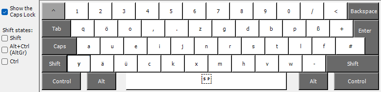
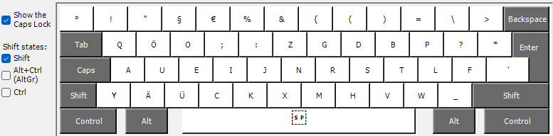

# pauls-german-keyboard-layout
Ich habe ein Tastatuslayout entworfen für schnelles Schreiben. Als Alternative zum QUERTZ, Dvorak und co.

Der besondere Kniff bei dem Layout: Ich habe die Feststelltaste umfunktioniert. Wenn es inaktiv ist, ist das Standardlayout aktiv. Wenn Feststelltaste aktiv ist, dann wird das neue Layout aktiv. Die Feststelltaste wird also nicht mehr für die Großschreibung verwendet (das habe ich ohnehin so gut wie nie benutzt).

Die Screenshots zeigen die gesamte Tastaturbelegung:

# Generieranleitung
Um das Layout nutzen zu können, muss eine Installationdatei generiert werden. Dafür verwende ich das Tool [Keyboard Layout Creator](https://www.microsoft.com/en-us/download/details.aspx?id=102134) von Microsoft.
Damit kann man die Datei "Pauls Layoout.klc" öffnen und im Menü *Projekt* -> *Build DLL and Setup Package* das Paket bauen. Dann kann man das installieren.

Wichtig zu wissen: Wenn das Layout bereits installiert ist, und man Änderungen vornehmen möchte, muss man zuerst die Tastatur wieder deinstallieren (über die für die Installation verwenedete Installationsdatei oder über die Windows-Einstellungen). Sonst weigert sich das Tool das Paket zu generieren.